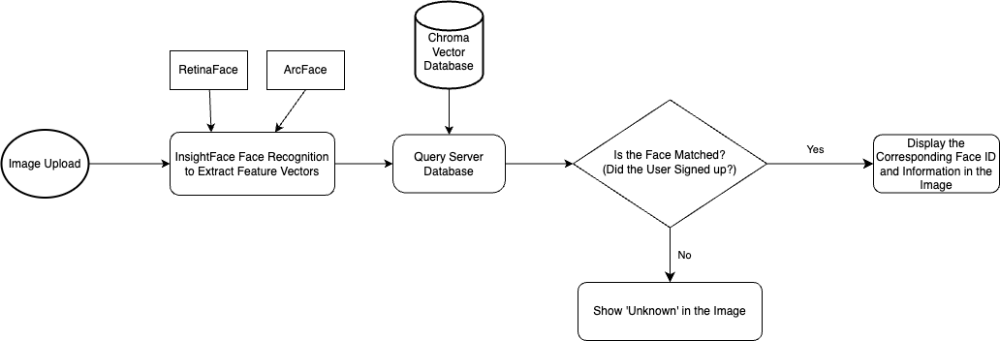

# Design & Build - FacePerks - Group 10 - Backend

Visit [FacePerks](https://service.design-build.site) (https://service.design-build.site) to view the live demo and
explore its features.

To view the full project, please visit the following repositories:

- [Server (Backend) Code](https://github.com/Design-Build-Group-10/Server) (https://github.com/Design-Build-Group-10/Server)
- [Web Client (Frontend) Code](https://github.com/Design-Build-Group-10/Web-Client) (https://github.com/Design-Build-Group-10/Web-Client)
- [Upper and Lower Computer Code](https://github.com/Design-Build-Group-10/Lower-And-Upper-Computer) (https://github.com/Design-Build-Group-10/Lower-And-Upper-Computer)
- [Face Recognition Code](https://github.com/Design-Build-Group-10/FaceRecognition) (https://github.com/Design-Build-Group-10/FaceRecognition)

## Table of Contents

[toc]

## Project Overview

FacePerks is a robust and efficient e-commerce platform that integrates facial recognition to enhance the user
experience for both customers and merchants. The backend system is built using Django as the web framework, MySQL for
relational data management, and Chroma Vector Database to handle facial recognition features. The project also
integrates InsightFace for high-precision face detection and recognition, using advanced algorithms such as RetinaFace
and ArcFace.

## System Functionality

The backend system is designed to automate the entire workflow from image capture to facial analysis, offering real-time
detection, recognition, and data management. Below is a detailed description of the key modules and their
implementations.

### Image Capture and Transmission

The system's first major feature is the ability to capture real-time images using cameras mounted on robots or local
cameras. Once captured, images undergo preprocessing, including cropping, grayscale conversion, and noise filtering, to
enhance face detection and recognition accuracy.

The image data is then transmitted in real-time to a Tencent Cloud Light Application server for further processing and
storage. We use efficient HTTP data transfer protocols, along with compression and error detection mechanisms, to ensure
high reliability and minimal data loss during transmission.

### Face Detection and Recognition

The face detection and recognition system is powered by InsightFace, utilizing two core algorithms: **RetinaFace** and
**ArcFace**.

For more details about these algorithms, visit
the [InsightFace GitHub repository](https://github.com/deepinsight/insightface).

#### RetinaFace

RetinaFace is a robust, single-stage facial detection algorithm designed for uncontrolled environments. It can handle
challenges such as occlusions, varying lighting conditions, and diverse face angles. RetinaFace performs face box
prediction, 2D facial landmark detection, and 3D vertex regression.

**Implementation**: After the server receives an image, it applies RetinaFace to detect faces in the image and generate
bounding boxes marking face regions.

#### ArcFace

ArcFace provides additive angular margin loss for highly discriminative face recognition features. This algorithm is
known for its accuracy in identity verification tasks across various face datasets.

**Implementation**: After detection, ArcFace extracts face feature vectors. These vectors are compared with stored face
data in the Chroma Vector Database to identify the person. If the person is identified, the system returns identity
information. Otherwise, the system stores the unidentified feature vector for future reference.

By combining RetinaFace and ArcFace, FacePerks achieves reliable 2D face alignment, robust 3D face reconstruction, and
high-performance recognition.

### Remote Data Synchronization & Storage

The backend system provides real-time data synchronization and storage of facial images and analysis results using
Chroma Vector Database.

#### Database Integration

- **Scalability and Stability**: Tencent Cloud servers offer high availability and the ability to scale as needed. This
  ensures that the database can handle increased loads and traffic during peak times.
- **Security**: All data is transmitted over secure protocols, ensuring the protection of sensitive information like
  facial feature vectors.

#### Data Storage

Once a face is detected and recognized, its feature vectors and metadata (such as user ID, gender, and age) are securely
stored in the database. This allows for seamless future identity verification and detailed analytics.

1. **Feature Vector Storage**: The system is optimized to handle high-dimensional vectors efficiently.
2. **Metadata Management**: Metadata is stored alongside feature vectors, enabling multidimensional queries (e.g.,
   searching by user ID, age, or other attributes).

### Face Recognition System

The face recognition pipeline of FacePerks is powered by **InsightFace**. Here's a breakdown of how it works:

1. **Face Detection**:
    - Uses **RetinaFace** to detect and localize faces in the image.

2. **Face Recognition**:
    - Applies **ArcFace** to extract and compare facial features with stored vectors in the Chroma database.

This combination ensures high accuracy and performance, even in real-time scenarios.

### Workflow Diagram

The diagram below illustrates the overall flow of the face recognition process, from image upload to identity
verification:



1. **Image Upload**: The system receives an image (captured by the robot or uploaded by a user).
2. **Feature Extraction**: InsightFace, powered by RetinaFace and ArcFace, extracts the face feature vectors from the
   image.
3. **Database Query**: These vectors are compared with the stored data in the Chroma Vector Database.
4. **Face Match Decision**:
    - If the face is recognized (i.e., the user has signed up), the corresponding face ID and information are displayed.
    - If not, the system marks the face as "Unknown."

## System Workflow

1. **Image Capture**: Cameras (robot or local) capture live images and transmit them to the server.
2. **Preprocessing**: The system preprocesses images for optimal facial recognition.
3. **Face Detection**: The preprocessed images are passed to the **RetinaFace** algorithm for face detection.
4. **Feature Extraction**: Detected faces are processed using **ArcFace** to extract unique feature vectors.
5. **Database Query**: The feature vectors are compared with vectors in the Chroma database to determine the identity.
6. **Result Handling**: The system either identifies the person or flags them for future recognition.

## Backend Technology Stack

- **Framework**: Django
- **Database**: MySQL and Chroma Vector Database (for facial recognition vectors)
- **Cloud Provider**: Tencent Cloud (for server hosting and storage)
- **Face Recognition**: InsightFace (RetinaFace and ArcFace algorithms)
- **Containerization**: Docker (for easy deployment and scalability)
- **API Integration**: RESTful APIs to manage communication between backend and other services

## Deployment Instructions

1. **Clone the repository**:

   ```bash
   git clone https://github.com/Design-Build-Group-10/Server.git
   ```

2. **Install dependencies**:

   ```bash
   pip install -r requirements.txt
   ```

3. **Configure the environment**:

   Before running the system, you must update the `config.yaml` file with your local settings. This configuration file
   is crucial for setting up database connections, Redis, and Chroma vector database connections.

   Example `config.yaml` file:

   ```yaml
   secret_key: "django-insecure-*&jy8si8ew8%-dj+^b!9ze#z5xcds-(^65as(zg2n##x=*ge#*"
   debug: true
   database:
     engine: "dj_db_conn_pool.backends.mysql"
     name: "server_bot"
     user: "root"
     password: "your_mysql_password"  # Replace with your MySQL password
     host: "localhost"
     port: "3306"
   redis:
     host: "localhost"
     port: "6379"
   chroma:
     host: "62.234.168.154"
     port: "3000"
   ```

   **Important**:
    - Replace `"your_mysql_password"` with your actual MySQL password.
    - Adjust other settings such as Redis host/port if your local setup differs.

4. **Run database migrations**:

   Before running the Django server, you need to set up the database by creating migrations and applying them:

   ```bash
   python manage.py makemigrations
   python manage.py migrate
   ```

5. **Run the Django server**:

   After the migrations are applied, you can start the Django development server:

   ```bash
   python manage.py runserver
   ```

## Conclusion

FacePerks' backend system provides a highly scalable and efficient platform for real-time facial recognition, leveraging
cutting-edge AI algorithms and cloud-based storage. With modular design and efficient database management, it ensures a
secure and reliable user experience for both customers and merchants.